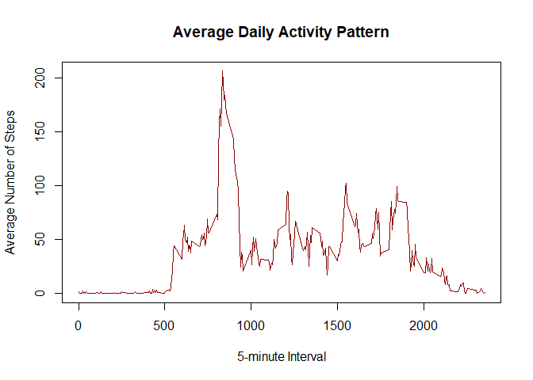
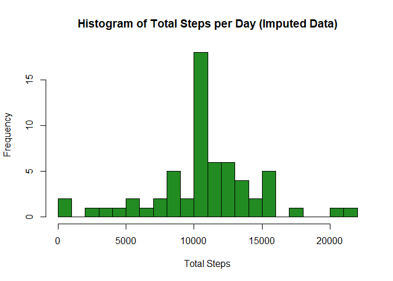

---
title: "Reproducible Research: Peer Assessment 1"
output: 
  html_document:
    keep_md: true
---


``` r
knitr::opts_chunk$set(echo = TRUE, warning = FALSE, message = FALSE)
```

## Loading and preprocessing the data


``` r
library(dplyr)
library(ggplot2)

if(!file.exists("activity.csv")) {
  unzip("activity.zip")
}

activity_data <- read.csv("activity.csv")
activity_data$date <- as.Date(activity_data$date, format="%Y-%m-%d")
```

## What is mean total number of steps taken per day?


``` r
daily_steps <- activity_data %>%
  filter(!is.na(steps)) %>%
  group_by(date) %>%
  summarize(total_steps = sum(steps))

hist(daily_steps$total_steps, 
     main = "Histogram of Total Steps per Day", 
     xlab = "Total Steps", 
     col = "steelblue", 
     breaks = 20)
```

<!-- -->

``` r
mean_steps <- mean(daily_steps$total_steps)
median_steps <- median(daily_steps$total_steps)
```

* **Mean total steps per day:** 10766.19
* **Median total steps per day:** 10765

## What is the average daily activity pattern?


``` r
interval_steps <- activity_data %>%
  filter(!is.na(steps)) %>%
  group_by(interval) %>%
  summarize(avg_steps = mean(steps))

plot(interval_steps$interval, interval_steps$avg_steps, 
     type = "l", 
     col = "darkred",
     main = "Average Daily Activity Pattern",
     xlab = "5-minute Interval",
     ylab = "Average Number of Steps")
```

<!-- -->

``` r
max_interval <- interval_steps$interval[which.max(interval_steps$avg_steps)]
```

* The 5-minute interval containing the maximum average number of steps is **835**.

## Imputing missing values


``` r
total_na <- sum(is.na(activity_data$steps))
```

* **Total number of missing values:** 2304


``` r
imputed_data <- activity_data %>%
  left_join(interval_steps, by = "interval") %>%
  mutate(steps = ifelse(is.na(steps), avg_steps, steps)) %>%
  select(-avg_steps)

daily_imputed_steps <- imputed_data %>%
  group_by(date) %>%
  summarize(total_steps = sum(steps))

hist(daily_imputed_steps$total_steps, 
     main = "Histogram of Total Steps per Day (Imputed Data)", 
     xlab = "Total Steps", 
     col = "forestgreen", 
     breaks = 20)
```

<!-- -->

``` r
mean_imputed <- mean(daily_imputed_steps$total_steps)
median_imputed <- median(daily_imputed_steps$total_steps)
```

* **New Mean:** 10766.19
* **New Median:** 10766.19

## Are there differences in activity patterns between weekdays and weekends?


``` r
imputed_data$day_type <- ifelse(weekdays(imputed_data$date) %in% c("Saturday", "Sunday"), "weekend", "weekday")
imputed_data$day_type <- as.factor(imputed_data$day_type)

interval_day_type <- imputed_data %>%
  group_by(interval, day_type) %>%
  summarize(avg_steps = mean(steps))

ggplot(interval_day_type, aes(x = interval, y = avg_steps, color = day_type)) +
  geom_line() +
  facet_wrap(~day_type, ncol = 1, nrow = 2) +
  labs(title = "Activity Patterns: Weekdays vs. Weekends",
       x = "5-minute Interval",
       y = "Average Number of Steps") +
  theme_minimal() +
  theme(legend.position = "none")
```

<!-- -->
